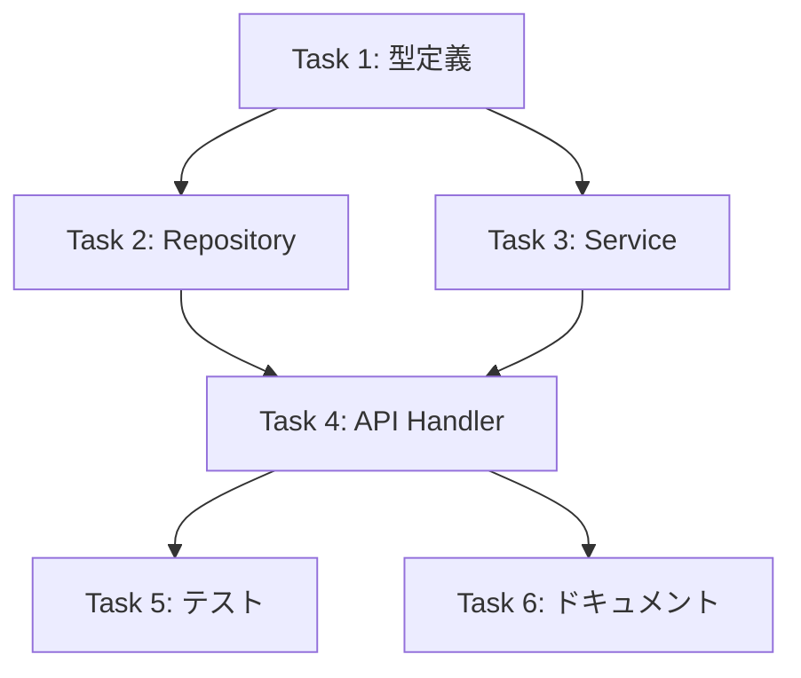

# Task Planner Templates

`task-planner/SKILL.md` から切り出した実装計画テンプレート集。

## Phase 2: コードベース調査コマンド集

```bash
# 関連ファイル検索
rg "keyword" --type ts

# ディレクトリ構造確認
eza --tree --level=3 src/

# 依存関係確認
npm ls <package-name>

# 型定義確認
rg "interface|type" --type ts src/types/
```

## Phase 4: 依存関係図テンプレート



### クリティカルパス
A → B → D → E

### 並列実行可能
- Task 2, Task 3（Task 1完了後）
- Task 5, Task 6（Task 4完了後）

## Phase 5: 実装計画出力フォーマット

```markdown
# 実装計画: [機能名]

## 概要
[1-2文で機能の説明]

## ゴール
- [ ] [成功基準1]
- [ ] [成功基準2]

## 前提条件
- [前提1]
- [前提2]

---

## Phase 1: 基盤構築

### Task 1.1: 型定義の追加
**ファイル**: `src/types/feature.ts`
**依存**: なし
**サイズ**: S

- [ ] インターフェース定義
- [ ] 型エクスポート
- [ ] 既存型との整合性確認

### Task 1.2: Repository実装
**ファイル**: `src/repositories/featureRepository.ts`
**依存**: Task 1.1
**サイズ**: M

- [ ] CRUDメソッド実装
- [ ] エラーハンドリング
- [ ] 単体テスト

---

## Phase 2: ビジネスロジック

### Task 2.1: Service実装
...

---

## Phase 3: API層

### Task 3.1: Handler実装
...

---

## Phase 4: テスト・ドキュメント

### Task 4.1: 統合テスト
...

### Task 4.2: ドキュメント更新
...

---

## リスク・注意事項
- [リスク1と対策]
- [リスク2と対策]

## 完了基準
- [ ] 全タスク完了
- [ ] テストパス
- [ ] レビュー承認
```

## 新機能追加テンプレート

```markdown
## 新機能: [機能名]

### Phase 1: 設計・準備
- [ ] 要件定義の確定
- [ ] 技術調査
- [ ] 型定義

### Phase 2: 実装
- [ ] ドメイン層
- [ ] インフラ層
- [ ] プレゼンテーション層

### Phase 3: 品質保証
- [ ] ユニットテスト
- [ ] 統合テスト
- [ ] E2Eテスト

### Phase 4: リリース
- [ ] ドキュメント
- [ ] コードレビュー
- [ ] デプロイ
```

## バグ修正テンプレート

```markdown
## バグ修正: [Issue番号]

### Phase 1: 調査
- [ ] 再現手順の確認
- [ ] 原因箇所の特定
- [ ] 影響範囲の調査

### Phase 2: 修正
- [ ] 修正実装
- [ ] リグレッションテスト追加
- [ ] 修正確認

### Phase 3: 検証
- [ ] ローカル検証
- [ ] ステージング検証
- [ ] 本番確認
```

## リファクタリングテンプレート

```markdown
## リファクタリング: [対象]

### Phase 1: 現状分析
- [ ] 問題点の特定
- [ ] 依存関係の把握
- [ ] テストカバレッジ確認

### Phase 2: 段階的改善
- [ ] ステップ1: [小さな改善]
- [ ] ステップ2: [次の改善]
- [ ] ステップ3: [最終形]

### Phase 3: 検証
- [ ] 既存テストパス
- [ ] パフォーマンス確認
- [ ] レビュー
```
